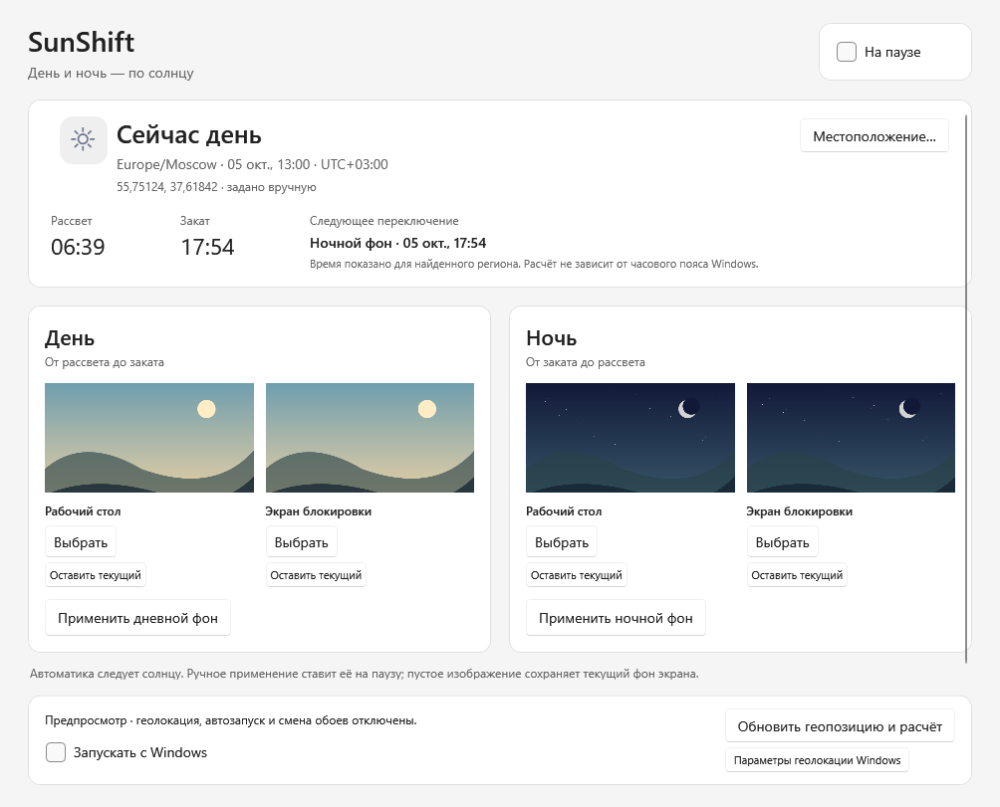
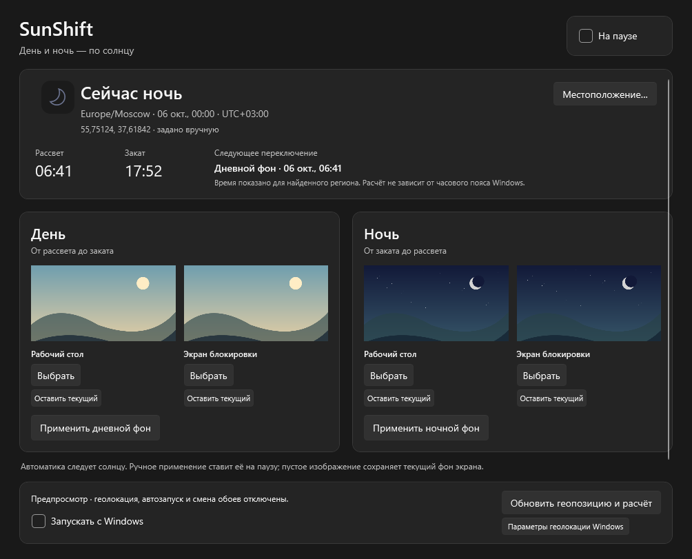

# SunShift

Фон рабочего стола и экрана блокировки по солнцу: геопозиция компьютера →
часовой пояс региона → рассвет/закат → дневные или ночные изображения.
Геозоны и радиусы вручную задавать не нужно.

## Запуск

[Скачать последний релиз](https://github.com/GodRayine/SunShift/releases/latest):
`SunShift-win-x64.zip` — готовая переносимая версия, `SunShift-v0.1.0-source.zip` — исходники.
Распакуйте переносимый архив и запустите `SunShift.exe`. .NET включён, установка не требуется.
Поддерживаются Windows 10 2004+ и Windows 11, обычный пользователь без повышения прав.

1. Запустите EXE. В блоке **День** выберите изображение рабочего стола и/или экрана
   блокировки. В блоке **Ночь** выберите изображения для ночи.
2. Нажмите **Обновить геопозицию и расчёт** и при необходимости разрешите геолокацию
   Windows. Часовой пояс региона будет определён автоматически по координатам.
3. Включите переключатель **На паузе / Автоматически**. Сразу применится профиль
   текущего состояния солнца, дальнейшая смена произойдёт при рассвете или закате.

День означает время от восхода солнца до заката, ночь — от заката до следующего
восхода. Используется стандартная высота центра солнца −0,833° с поправкой на
рефракцию и размер солнечного диска. Гражданские сумерки отдельным состоянием
не являются. В полярный день выбирается дневной фон, в полярную ночь — ночной.

В окне показаны текущий регион, местное время, координаты, время рассвета/заката
и ближайшего переключения. Время вычисляется для найденного региона, независимо
от выбранного в Windows часового пояса. Часы и часовой пояс самой Windows программа
не меняет. Вычисления приблизительные: атмосфера, высота и местный горизонт могут
изменять наблюдаемое время. Расчёт рассчитан на управление обоями, а не измерения.

Пустое изображение сохраняет текущий фон соответствующего экрана. Кнопки
**Применить дневной/ночной фон** применяют выбранный профиль сразу и ставят
автоматику на паузу. Эти кнопки можно использовать для проверки смены двух экранов.
Светлая/тёмная тема интерфейса и акцент следуют Windows; оформление приложения
не зависит от того, какой профиль обоев сейчас активен.

## Местоположение и фоновая работа

- Основной источник — геолокация Windows. В системных параметрах расположения
  включите службы расположения и доступ для классических приложений. В приложении
  есть кнопка перехода к этим параметрам.
- **Местоположение… → Указать координаты вручную** — запасной вариант для ПК без
  доступной геолокации. Широта от −90 до 90, долгота от −180 до 180; точка и запятая
  допустимы. Часовой пояс и солнечные события при этом также вычисляются автоматически.
- Состояние солнца проверяется каждые 30 секунд, геопозиция — раз в 5 минут.
  После пробуждения от сна производится внеочередная проверка. Windows может
  определять координаты до 25 секунд; переключение следует за завершением проверки.
- При временном сбое геолокации используется последняя достоверная позиция,
  если она не старше 24 часов. В интерфейсе указан её возраст, а сообщение объясняет
  использование сохранённых координат. После 24 часов фон не меняется до получения
  новой позиции. При переезде обновите геопозицию вручную для немедленного пересчёта.
- Часовой пояс определяется локальной базой GeoTimeZone; солнечные события
  рассчитываются локально по формулам NOAA/Meeus. Нет географических веб-запросов,
  API-ключей или передачи координат на серверы SunShift. Системная служба Windows
  может использовать сеть согласно её настройкам.
- Крестик скрывает окно в трей; двойной щелчок по значку открывает его.
  Меню трея позволяет поставить автоматику на паузу или **выйти** из приложения.
- **Запускать с Windows** добавляет текущий EXE в автозапуск пользователя. Сначала
  перенесите EXE в постоянную папку. Если переместили его после включения автозапуска,
  выключите и снова включите флажок. Автозапуск открывает приложение в трее и
  восстанавливает сохранённое состояние автоматики. Одновременно работает один экземпляр.

## Экран блокировки и данные

Рабочий стол меняется через Win32, экран блокировки — через официальный
`UserProfilePersonalizationSettings`. Windows может отклонить смену экрана
блокировки из-за поддержки API, режима оформления или политики устройства.
Сообщение об этом появляется в окне; успешная смена рабочего стола учитывается
отдельно. Повторяется только неудавшееся изображение. Для предсказуемого результата
выберите **Фото/Изображение** вместо Spotlight или слайд-шоу в персонализации Windows.
Административные политики приложение не обходит.

Настройки и выбранные изображения: `%LOCALAPPDATA%\SunShift`.
Файлы JPG, PNG и BMP копируются и конвертируются в PNG; исходные файлы можно
перемещать. Ограничения — 40 МБ на файл и 60 мегапикселей на изображение.
Настройки содержат четыре пути, ручные координаты (если выбраны) и одну последнюю
позицию, без истории перемещений. JSON сохраняется атомарно; повреждённый файл
копируется в `settings.json.recovery-*`, запуск продолжается с выключенной автоматикой.
Старые импортированные картинки сохраняются, чтобы не удалить фон, используемый Windows.

## Разработка

Windows и .NET 10 SDK. Первое восстановление NuGet требует сеть.
Распакуйте архив исходников из релиза и откройте PowerShell в папке с `SunShift.slnx`,
либо клонируйте репозиторий:

```powershell
git clone https://github.com/GodRayine/SunShift.git
cd SunShift
```

```powershell
dotnet build SunShift.slnx -c Release
dotnet test SunShift.slnx -c Release
dotnet run --project src/SunShift.App
powershell -NoProfile -ExecutionPolicy Bypass -File scripts/Publish.ps1
```

Для ARM64: `scripts/Publish.ps1 -Runtime win-arm64`.
Код ядра — `src/SunShift.Core`, Windows-интерфейс — `src/SunShift.App`.
`PLAN.md` содержит план и критерии новой разработки.
Готовый результат сборки: `artifacts/portable-win-x64/SunShift.exe` и
`artifacts/SunShift-win-x64.zip`.

## Интерфейс





Снимки сделаны в изолированном режиме предпросмотра с демонстрационными изображениями.

## Лицензия

Copyright (C) 2026 GodRayine. Код SunShift распространяется по
**GNU GPL версии 3 или любой более поздней** (`GPL-3.0-or-later`), без гарантий.
Полный текст — [LICENSE](LICENSE), уведомление — [COPYRIGHT](COPYRIGHT).
Исходники доступны в репозитории и в архиве каждого релиза.
Лицензии сторонних компонентов и географических данных сохранены отдельно:
[THIRD-PARTY-NOTICES.md](THIRD-PARTY-NOTICES.md) и каталог `Licenses`.
Текст GNU GPL также доступен через меню трея **О программе и лицензии**.

## Проверка

Пройдены 27 сценарных тестов: сверка восхода/заката с независимыми данными USNO
для Москвы, Нью-Йорка и Сиднея (расхождение менее 2 минут); географические часовые
пояса; границы рассвета/заката; полярный день/ночь; оба перехода на летнее/зимнее
время; линия смены даты; следующий рассвет; устаревшая позиция; смена день–ночь–день;
повтор частичных сбоев; ручное применение; отмена; конкуренция; восстановление JSON.
Release-сборка без ошибок и предупреждений. Проверены рендеры дневного/ночного
состояния, обеих тем, первого запуска, полярных состояний и окна координат.

Изолированный предпросмотр, который не меняет обои, разрешения и автозапуск:

```powershell
.\artifacts\portable-win-x64\SunShift.exe --preview
.\artifacts\portable-win-x64\SunShift.exe --preview --night --dark
```

Снимок интерфейса: `--smoke-test --output <путь.png>`; флаги `--dark`, `--light`,
`--night`, `--empty`, `--polar-day`, `--polar-night`, `--location`, `--about` выбирают сценарий.
Проверка поддержки API блокировки без изменения системы:
`--diagnostics --output <путь.json>`.
Реальные разрешения геолокации и фактическое изменение системных фонов при разработке
не запускались. `IsSupported` не гарантирует успешную установку конкретного файла.

Источники расчёта и проверки:
[NOAA — формулы и ограничения](https://gml.noaa.gov/grad/solcalc/calcdetails.html),
[USNO — данные Москвы 05.10.2026](https://aa.usno.navy.mil/api/rstt/oneday?date=2026-10-05&coords=55.751244,37.618423&tz=3),
[USNO — данные Нью-Йорка 21.06.2026](https://aa.usno.navy.mil/calculated/rstt/oneday?date=2026-06-21&dst=false&label=New+York%2FLa+Guardia&lat=40.7667&lon=-73.9&submit=Get+Data&tz=-4.00&tz_label=false&tz_sign=1),
[USNO — данные Сиднея 21.12.2026](https://aa.usno.navy.mil/api/rstt/oneday?date=2026-12-21&coords=-33.8688,151.2093&tz=11).
