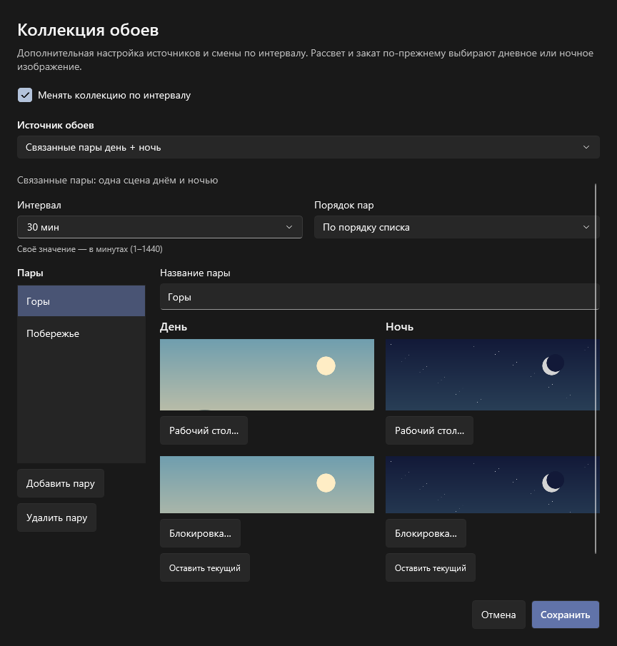

# SunShift

Версия 0.5.1 — синхронизация вкладки и предпросмотра с рассветом и закатом.
Геопозиция хранится только в памяти; подготовка MSIX для Store сохранена.

Фон рабочего стола и экрана блокировки по солнцу: геопозиция компьютера →
часовой пояс региона → рассвет/закат → дневные или ночные изображения.
Геозоны и радиусы вручную задавать не нужно.

## Запуск

Локальная сборка 0.5.1: `artifacts/portable-win-x64-v0.5.1/SunShift.exe` и
`artifacts/SunShift-v0.5.1-win-x64.zip`.
Подготовка MSIX и карточки магазина: [store/README.md](store/README.md).
Идентификаторы продукта Store получены: `Gordry.SunShift`, издатель `Gordry`.
Команда сборки пакета и оставшиеся проверки описаны в `store/README.md`.
[Опубликованные релизы на GitHub](https://github.com/GodRayine/SunShift/releases).
Распакуйте переносимый архив и запустите `SunShift.exe`. .NET включён, установка не требуется.
Поддерживаются Windows 10 2004+ и Windows 11, обычный пользователь без повышения прав.

1. Запустите EXE. Во вкладках **День** и **Ночь** выберите изображения.
   Для папок или связанных пар откройте отдельный блок
   **Коллекция обоев → Настроить коллекцию…**.
2. Нажмите **Обновить геопозицию** и при необходимости разрешите геолокацию
   Windows. Часовой пояс региона будет определён автоматически по координатам.
3. Включите **Автоматическая смена обоев → Включена**. Сразу применится профиль
   текущего состояния солнца, дальнейшая смена произойдёт при рассвете или закате.

День означает время от восхода солнца до заката, ночь — от заката до следующего
восхода. Используется стандартная высота центра солнца −0,833° с поправкой на
рефракцию и размер солнечного диска. Гражданские сумерки отдельным состоянием
не являются. В полярный день выбирается дневной фон, в полярную ночь — ночной.

В окне показаны текущий регион, местное время, координаты, время рассвета/заката
и ближайшего переключения. Время вычисляется для найденного региона, независимо
от выбранного в Windows часового пояса. Часы и часовой пояс самой Windows программа
не меняет. Вычисления приблизительные: атмосфера, высота и местный горизонт могут
изменять наблюдаемое время. Расчёт рассчитан на управление обоями, а не измерения.

Пустое изображение сохраняет текущий фон соответствующего экрана. Кнопка
**Применить выбранный фон** применяет открытый профиль сразу и ставит
автоматику на паузу. Переключение вкладки выбирает профиль для редактирования;
текущие системные фоны от этого не меняются. Автоматика продолжает использовать
реальное состояние солнца, даже если открыт другой профиль.
При следующем рассвете или закате включённая автоматика также переключает
вкладку и предпросмотр к текущему профилю. Между переходами выбранная для
редактирования вкладка сохраняется; на паузе переходы её не меняют.

По умолчанию тема интерфейса следует Windows. В поле **Тема интерфейса** можно
выбрать светлую или тёмную тему; выбор сохраняется. Акцент берётся из Windows.
Тема интерфейса не зависит от текущего профиля обоев. В рабочем приложении время
реальное; ползунка времени и демонстрационных регионов нет.

## Коллекция обоев — дополнительная настройка

Блок **Коллекция обоев** отделён от основного переключателя автоматической
смены дня и ночи. Кнопка **Настроить коллекцию…** открывает два режима источников:
**Папки для дня и ночи** или **Связанные пары день + ночь**. Настройки обоих режимов
сохраняются при переключении, одновременно используется выбранный режим.

Флажок **Менять по интервалу** управляет только таймером коллекции.
Если выключить его, текущая сцена или кадр сохраняется, а рассвет и закат
продолжают менять дневной/ночной вариант при включённой основной автоматике.
Включение флажка начинает отсчёт заново, без немедленной смены кадра.
Основная **Автоматическая смена обоев → На паузе** останавливает все
автоматические изменения. При первом запуске оба переключателя выключены.

### Папки

В окне коллекции кнопки **Выбрать папки для дня…** и **Выбрать папки для ночи…**
открывают настройку соответствующего профиля:

- Отдельные папки для рабочего стола и экрана блокировки. Одну папку можно
  использовать для обоих экранов или обоих профилей. Если папка не задана,
  применяется выбранное одиночное изображение этого экрана.
- Готовые интервалы: 1, 5, 15, 30 минут; 1, 2, 4, 8, 12 часов; **Раз в день**
  (24 часа). Можно ввести своё целое число минут от 1 до 1440.
  По умолчанию — 30 минут. Интервал общий для двух экранов внутри профиля;
  дневной и ночной профили могут иметь разные интервалы.
- Порядок **По имени файла** или **Случайный**, без повторения предыдущего кадра,
  если доступно несколько файлов. В двух разных папках изображения выбираются
  независимо; одинаковые папки в последовательном режиме идут синхронно.

Таймер пулов работает при включённых **Автоматической смене обоев** и
**Менять по интервалу**. Рассвет и закат
сразу переключают профиль, независимо от интервала. Текущая папка проверяется
каждые 30 секунд: добавленные файлы попадают в пул, удалённый текущий кадр заменяется.
Поэтому смена по интервалу может произойти с задержкой до 30 секунд, не считая
времени чтения и установки изображения. После сна пропущенные кадры не перебираются.
В верхнем блоке показана ближайшая смена фона: кадр из активного пула или
солнечный переход, если он наступит раньше. Время — местное для найденного региона.

Поддерживаются JPG/JPEG, PNG и BMP непосредственно в папке, без подпапок;
до 10 000 изображений. Исходные файлы читаются, поэтому папку нужно сохранять
доступной. Оригиналы не изменяются. Ограничения файла: 40 МБ и 60 мегапикселей.
Повреждённые или слишком большие файлы пропускаются с сообщением и повторно
проверяются через 5 минут. За одну проверку пробуются до 10 кандидатов.
Если папка опустела или недоступна, фон этого экрана сохраняется; проверка
возобновляется автоматически. Если доступен только один кадр, он не записывается
заново по таймеру. Изменение содержимого файла обнаруживается по размеру и времени записи.

**На паузе** останавливает и солнечные переходы, и смену по интервалу.
После запуска или возобновления отсчёт начинается заново: первый файл по имени
или случайный кадр. **Применить выбранный фон** применяет кадр выбранного профиля
однократно и ставит автоматику на паузу. **Выбрать изображение** отключает папку
для этого экрана; **Оставить текущий** сбрасывает и изображение, и папку.
**Без папки** в настройке пула возвращает сохранённое одиночное изображение.


### Связанные пары

Выберите **Связанные пары день + ночь**, нажмите **Добавить пару**, задайте
название и два изображения рабочего стола: дневное и ночное.
Изображения экрана блокировки необязательны: пустое поле сохраняет системный фон.
Можно добавить до 500 пар. Выбранная в списке пара становится текущей после
сохранения; изменения до сохранения и отмена не меняют рабочие настройки.

Например, пара «Горы» содержит вид тех же гор днём и ночью. На закате выбирается
ночной вариант «Гор», без перехода к другой паре. Таймер выбирает следующую пару
целиком: например, «Побережье», с вариантом для текущего состояния солнца.
Интервал 1–1440 минут и порядок списка или случайный выбор действуют на пары.
Случайный порядок исключает предыдущую пару, если есть альтернатива.
Текущая пара сохраняется после перезапуска; отсчёт таймера начинается заново.

Картинки пары импортируются в каталог SunShift, поэтому исходники можно перемещать.
Если сохранённое изображение стало недоступно, приложение сохраняет фон этого
экрана и сообщает об ошибке; связь дня и ночи не разрывается.
В основном окне показываются изображения текущей пары, её название и интервал.
Для редактирования пары откройте коллекцию.



## Местоположение и фоновая работа

- Основной источник — геолокация Windows. В системных параметрах расположения
  включите службы расположения и доступ для классических приложений. В приложении
  есть кнопка перехода к этим параметрам.
- **Источник и координаты… → Указать координаты вручную** — запасной вариант для ПК без
  доступной геолокации. Широта от −90 до 90, долгота от −180 до 180; точка и запятая
  допустимы. Часовой пояс и солнечные события при этом также вычисляются автоматически.
  Координаты существуют только в текущем сеансе: после выхода их нужно ввести заново.
  В ручном режиме кнопка обновления называется **Обновить расчёт**.
- Состояние солнца проверяется каждые 30 секунд, геопозиция — раз в 5 минут.
  После пробуждения от сна производится внеочередная проверка. Windows может
  определять координаты до 25 секунд; переключение следует за завершением проверки.
- При временном сбое геолокации используется последняя достоверная позиция,
  если она не старше 24 часов. В интерфейсе указан её возраст, а сообщение объясняет
  использование позиции из памяти текущего сеанса. После 24 часов фон не меняется до получения
  новой позиции. При переезде обновите геопозицию вручную для немедленного пересчёта.
- **Не использовать местоположение** забывает позицию и ставит автоматику на паузу.
  Отказ в разрешении Windows также прекращает использование прежней позиции.
- Часовой пояс определяется локальной базой GeoTimeZone; солнечные события
  рассчитываются локально по формулам NOAA/Meeus. Нет географических веб-запросов,
  API-ключей или передачи координат на серверы SunShift. Системная служба Windows
  может использовать сеть согласно её настройкам.
- Крестик скрывает окно в трей; двойной щелчок по значку открывает его.
  Меню трея позволяет поставить автоматику на паузу или **выйти** из приложения.
- Кнопка **Выйти** в верхней панели полностью завершает приложение и работу в трее.
- В MSIX **Запускать с Windows** использует Windows StartupTask; системное отключение
  в параметрах автозагрузки не обходится. В портативной версии флажок добавляет текущий EXE
  в автозапуск пользователя. Сначала
  перенесите EXE в постоянную папку. Если переместили его после включения автозапуска,
  выключите и снова включите флажок. Автозапуск открывает приложение в трее и
  восстанавливает сохранённое состояние автоматики. Одновременно работает один экземпляр.

## Экран блокировки и данные

Рабочий стол меняется через Win32, экран блокировки — через официальный
`UserProfilePersonalizationSettings`. Windows может отклонить смену экрана
блокировки из-за поддержки API, режима оформления или политики устройства.
Сообщение об этом появляется в окне; успешная смена рабочего стола учитывается
отдельно. Повторяется только неудавшееся изображение. Для предсказуемого результата
выберите **Фото/Изображение** вместо Spotlight или слайд-шоу в персонализации Windows.
Административные политики приложение не обходит.

Настройки и выбранные изображения: `%LOCALAPPDATA%\SunShift`.
Файлы JPG, PNG и BMP копируются и конвертируются в PNG; исходные файлы можно
перемещать. Ограничения — 40 МБ на файл и 60 мегапикселей на изображение.
Настройки содержат пути изображений и папок, пары и выбранную сцену,
режим источника геопозиции, тему и интервалы. Координаты в JSON не попадают.
Политика: [PRIVACY.md](PRIVACY.md). JSON сохраняется атомарно; повреждённый файл
сохраняется без геопозиции в `settings.json.recovery-*`, запуск продолжается с выключенной автоматикой.
Старые импортированные картинки сохраняются, чтобы не удалить фон, используемый Windows.
Настройки версий 0.1.0–0.3.0 читаются без сброса изображений и автоматического режима.
У существующих пулов 0.3.0 таймер коллекции автоматически остаётся включённым.
В `PoolCache` хранится не более четырёх подготовленных PNG — по два на экран;
кэш не растёт с количеством смен.
При обновлении завершите прежний экземпляр через **трей → Выход**, замените EXE
и запустите новую версию. Если поменялся путь EXE, обновите флажок автозапуска.

## Разработка

Windows и .NET 10 SDK. Первое восстановление NuGet требует сеть.
Распакуйте архив исходников из релиза и откройте PowerShell в папке с `SunShift.slnx`,
либо клонируйте репозиторий:

```powershell
git clone https://github.com/GodRayine/SunShift.git
cd SunShift
```

```powershell
dotnet build SunShift.slnx -c Release
dotnet test SunShift.slnx -c Release
dotnet run --project src/SunShift.App
powershell -NoProfile -ExecutionPolicy Bypass -File scripts/Publish.ps1
```

Для ARM64: `scripts/Publish.ps1 -Runtime win-arm64`.
Код ядра — `src/SunShift.Core`, Windows-интерфейс — `src/SunShift.App`.
`PLAN.md` содержит план и критерии новой разработки.
Готовый результат сборки: `artifacts/portable-win-x64-v0.5.1/SunShift.exe` и
`artifacts/SunShift-v0.5.1-win-x64.zip`.

## Интерфейс

Решения по рабочему интерфейсу: [дизайн SunShift](design-system/MASTER.md).
Принятый макет перенесён в основное приложение; отдельный прототип удалён.


Снимки сделаны в изолированном режиме предпросмотра с демонстрационными изображениями.

## Лицензия

Copyright (C) 2026 GodRayine. Код SunShift распространяется по
**GNU GPL версии 3 или любой более поздней** (`GPL-3.0-or-later`), без гарантий.
Полный текст — [LICENSE](LICENSE), уведомление — [COPYRIGHT](COPYRIGHT).
Исходники доступны в репозитории и в архиве каждого релиза.
Лицензии сторонних компонентов и географических данных сохранены отдельно:
[THIRD-PARTY-NOTICES.md](THIRD-PARTY-NOTICES.md) и каталог `Licenses`.
Текст GNU GPL также доступен через кнопку **Лицензия** и меню трея **О программе и лицензии**.

## Проверка

Пройдены 55 сценарных тестов: сверка восхода/заката с независимыми данными USNO
для Москвы, Нью-Йорка и Сиднея (расхождение менее 2 минут); географические часовые
пояса; границы рассвета/заката; полярный день/ночь; оба перехода на летнее/зимнее
время; линия смены даты; следующий рассвет; устаревшая позиция; смена день–ночь–день;
повтор частичных сбоев; ручное применение; отмена; конкуренция; восстановление JSON;
совместимость старых настроек и сохранение темы; интервалы, случайный порядок,
сон и перевод часов, доступность папок, изменения пула, пропуск повреждённых
изображений и обнаружение изменения подготовленного файла.
Дополнительно пройдены 66 проверок основного окна: редактор профиля отдельно
от активного состояния солнца, ручное применение и пауза, импортированные пути,
сохранение изменений и темы, маршрутизация геолокации и ручных координат, отказ доступа;
настройка папок и произвольного интервала, смена по таймеру, пауза/возобновление,
восстановление папки, солнечный переход, ограниченный кэш и сохранность оригиналов.
Для этих проверок системные службы заменены подставными; настройки пишутся в
отдельную временную папку.
Проверены связи пар на рассвете/закате, общий таймер пары, сохранение сцены,
независимое отключение таймера и кнопки общей верхней панели.
Проверены синхронизация вкладок и предпросмотра на обоих солнечных переходах,
сохранение выбора между проверками и на паузе, а также запуск ночью.
Release-сборка без ошибок и предупреждений. Проверены рендеры дневного/ночного
состояния, обеих тем, первого запуска, полярных состояний и окна координат.

Изолированный предпросмотр, который не меняет обои, разрешения и автозапуск:

```powershell
.\artifacts\portable-win-x64-v0.5.1\SunShift.exe --preview
.\artifacts\portable-win-x64-v0.5.1\SunShift.exe --preview --night --dark
```

Снимок интерфейса: `--smoke-test --output <путь.png>`; флаги `--dark`, `--light`,
`--night`, `--empty`, `--polar-day`, `--polar-night`, `--location`, `--about`,
`--narrow`, `--large-text`, `--pool`, `--rotation`, `--pairs`, `--collection` выбирают сценарий.
Проверка рабочего UI и настроек с изолированными системными службами:
`--integration-test --output <путь.json>`.
Проверка поддержки API блокировки без изменения системы:
`--diagnostics --output <путь.json>`.
Реальные разрешения геолокации и фактическое изменение системных фонов при разработке
не запускались. `IsSupported` не гарантирует успешную установку конкретного файла.

Источники расчёта и проверки:
[NOAA — формулы и ограничения](https://gml.noaa.gov/grad/solcalc/calcdetails.html),
[USNO — данные Москвы 05.10.2026](https://aa.usno.navy.mil/api/rstt/oneday?date=2026-10-05&coords=55.751244,37.618423&tz=3),
[USNO — данные Нью-Йорка 21.06.2026](https://aa.usno.navy.mil/calculated/rstt/oneday?date=2026-06-21&dst=false&label=New+York%2FLa+Guardia&lat=40.7667&lon=-73.9&submit=Get+Data&tz=-4.00&tz_label=false&tz_sign=1),
[USNO — данные Сиднея 21.12.2026](https://aa.usno.navy.mil/api/rstt/oneday?date=2026-12-21&coords=-33.8688,151.2093&tz=11).
